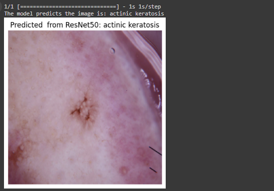

# Automated Skin Cancer Diagnosis using CNNs

## Overview
This project applies deep learning techniques, specifically Convolutional Neural Networks (CNNs), for the automated diagnosis of skin cancer. Utilizing TensorFlow and Keras, the project leverages pretrained models like ResNet50 and VGG19, which are fine-tuned for classifying various types of skin lesions from dermatoscopic images.

## Key Features
- **Pretrained CNN Models**: Uses ResNet50 and VGG19 for robust feature extraction and classification accuracy.
- **Data Augmentation**: Enhances the model's ability to generalize by introducing variations in the training data, simulating real-world conditions.
- **Automated Diagnosis**: Aims to assist dermatologists by providing rapid and accurate assessments of potential skin cancer cases, improving clinical outcomes through early detection.

## Technologies Used
- **TensorFlow & Keras**: For building and training the neural network models.
- **Python**: The primary programming language for development.
- **OpenCV**: Used for image processing tasks.

## Dataset
The project uses an extensive dataset from The International Skin Imaging Collaboration (ISIC), which includes 2357 images categorized into nine different classes representing various skin conditions.

## Model Performance
- **ResNet50**: Achieved high accuracy, demonstrating the effectiveness of transfer learning in handling complex image classification tasks.
- **Custom CNN Architecture**: Custom-built CNNs also tested, providing insights into the architectural and operational nuances of skin lesion classification.

